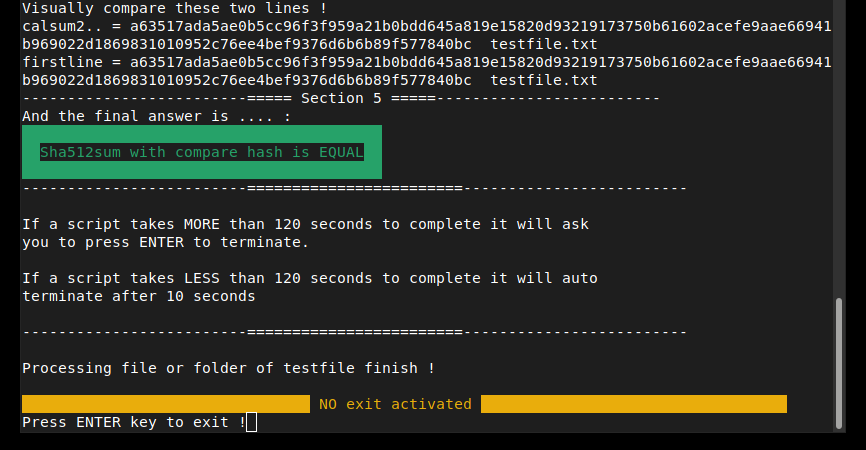

Check/compare bash sha 512 
--------------------------------------------------------------------

FREE Linux Bash software by LostByteSoft

No CopyRIGHT or CopyLEFT, i am just in the CENTER. That not perfect but me neither.

Bash sha 512 verification help tool.

Easy way or not in bash to verify create and hash a file in sha 512.

In each file you can replace sha512sum by any check sum you want : crc32, sha-1, ... etc

Things do !
--------------------------------------------------------------------

* Check_sha512.sh auto load *.sha512 file if exist.
* Select the good hash (good line) in file if many is present.

Files and use
--------------------------------------------------------------------

-Check_sha512.sh

	The main software. Will ask for 1 files (and check if hash file exist then autoload
	OR ask for a second file WITH MULTIPLE HASH INSIDE and compare the hash include in the second specified/automatic
	file OR (if you click cancel) offer to create new sha512 file.
	
	-ask for 1 file
	-watch if *.sha512 exist and load (of the same name *.sha512)	
	-if not exist, ask for a hash file (*.sha512 *.txt).
	-If you don't provide a file will create a new *.sha512 file.
	-If you provide a hash file with multiple hash inside it will take the good line.

Specials & extras
--------------------------------------------------------------------

-create_sha512.sh

	Ask for one file to hash and create *.sha512 file. With correct name and formatting. Only for one file

-testfile.txt

	This is the test file to hash.

-testfile.txt.sha512

	In this file there are the pre-calculated hash and the file name. You (if you create
	 this file) must follow the corect format, or correct the file to respect the format. 
	 HOW: Is the hash code plus two (2) spaceS and the name of the file.
	 Exemple of the first line : 

	 a63517ada5ae0b5cc96f3f959a21b0bdd645a819e15820d93219173750b61602acefe9aae66941b969022d1869831010952c76ee4bef9376d6b6b89f577840bc  testfile.txt
	

FREE Linux Bash software by LostByteSoft

--------------------------------------------------------------------

	JUST DO WHAT YOU WANT WITH THE PUBLIC LICENSE

	Version 3.1415926532 (January 2022)

	TERMS AND CONDITIONS FOR COPYING, DISTRIBUTION AND MODIFICATION
   
	Everyone is permitted to copy and distribute verbatim or modified copies of
	this license document.

	As is customary and in compliance with current global and interplanetary
	regulations, the author of these pages disclaims all liability for the
	consequences of the advice given here, in particular in the event of partial
	or total destruction of the material, Loss of rights to the manufacturer
	warranty, electrocution, drowning, divorce, civil war, the effects of radiation
	due to atomic fission, unexpected tax recalls or encounters with
	extraterrestrial beings elsewhere.

	LostByteSoft no copyright or copyleft we are in the center.

--------------------------------------------------------------------
# --- End of file ---
