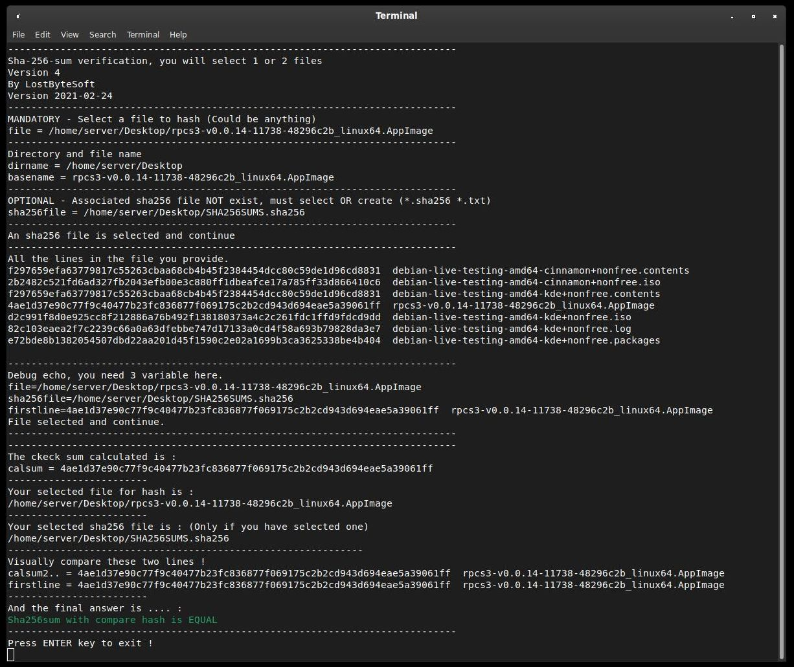
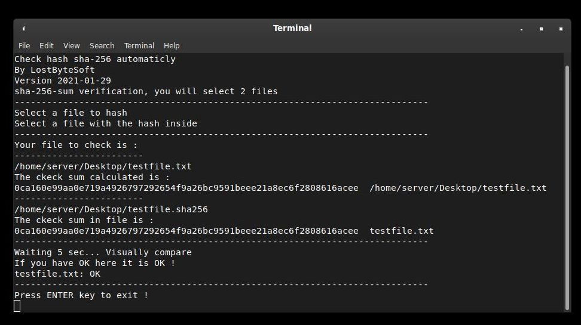
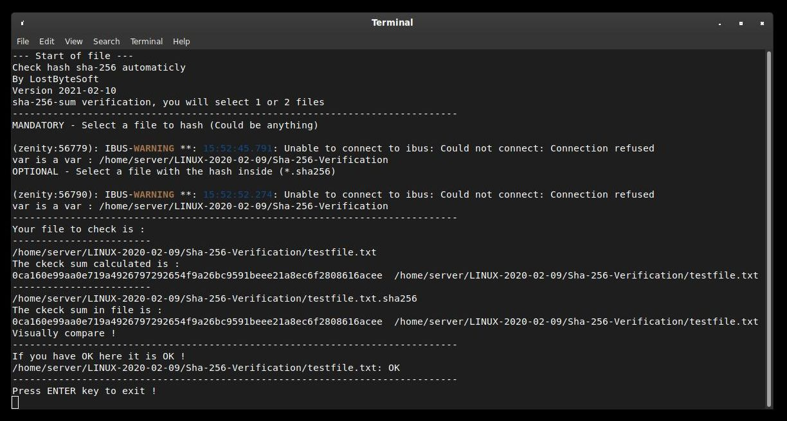
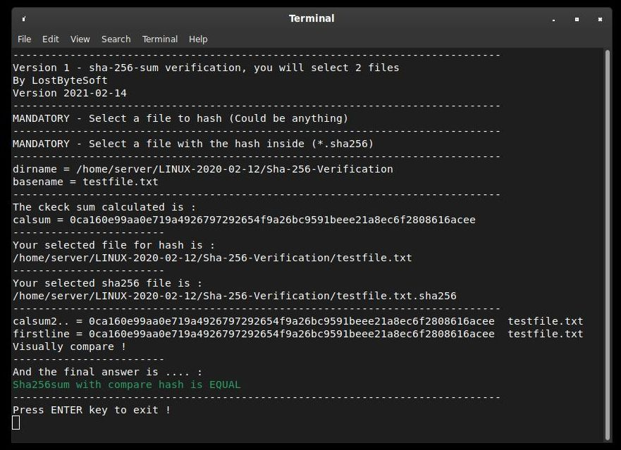

Check/compare bash sha 256 
--------------------------------------------------------------------

FREE Linux Bash software by LostByteSoft

No CopyRIGHT or CopyLEFT, i am juste in the CopyCENTER. That not perfect but me neither.

Bash sha 256 verification help tool.

Easy way or not in bash to verify create and hash a file in sha 256.

In each file you can replace sha256sum by any check sum you want : crc32, sha-1, ... etc

Things to do !
--------------------------------------------------------------------

* WORK (Check_sha256_V2.sh) auto load *.sha256 file if exist.
* WORK select the good hash (good line) in file if many is present.
* WORK Offer to create sha file if not provided and not existent (Check_sha256_V4.sh)
* Other check : sha512, crc32 , ...
* Verify all files in a specified folder with the file sha256sums.sha256

* i'm sure there are more to do....

Files and use
--------------------------------------------------------------------

-Check_sha256_V1.sh, base version

	The main software. Will ask for 2 files, one after another, and compare the hash
	include in the second specified file.
	
	-ask for 2 file (You must fournish 2 files)

-Check_sha256_V2.sh

	The main software. Will ask for 1 files (and check if hash file exist then
	autoload OR ask for a second file and compare the hash include in the second specified/automatic
	file.
	
	-ask for 1 file
	-watch if *.sha256 exist and load (of the same name *.*)
	-if not exist, ask for a hash file (*.sha256 *.txt).
	
-Check_sha256_V3.sh

	The main software. Will ask for 1 files (and check if hash file exist then autoload
	OR ask for a second file and compare the hash include in the second specified/automatic
	file OR (if you click cancel) offer to create new sha256 file.
	
	-ask for 1 file
	-watch if *.sha256 exist and load (of the same name *.*)	
	-if not exist, ask for a hash file (*.sha256 *.txt).
	-If you don't provide a file will create a new *.sha256 file.
	
-Check_sha256_V4.sh, BEST version to use.

	The main software. Will ask for 1 files (and check if hash file exist then autoload
	OR ask for a second file WITH MULTIPLE HASH INSIDE and compare the hash include in the second specified/automatic
	file OR (if you click cancel) offer to create new sha256 file.
	
	-ask for 1 file
	-watch if *.sha256 exist and load (of the same name *.*)	
	-if not exist, ask for a hash file (*.sha256 *.txt).
	-If you don't provide a file will create a new *.sha256 file.
	-If you provide a hash file with multiple hash inside it will take the good line.
	
-Check_sha256_V5.sh, in beta developpement (NOT included).

	The main software. Will ask for 1 files (and check if hash file exist then autoload
	OR ask for a second file WITH MULTIPLE HASH INSIDE and compare the hash include in the second specified/automatic
	file OR (if you click cancel) offer to create new sha256 file.
	
	-ask for 1 FOLDER
	-watch if sha256sums.sha256 exist and load	
	-if not exist, ask for a hash file (*.sha256 *.txt).
	-If you don't provide a file will create a new *.sha256 file for entire FOLDER.
	-Compare all files in folder, sha256 lines in file.

Screenshot of the version 4.

Specials & extras
--------------------------------------------------------------------

-create_sha256.sh

-create_sha512.sh

	Ask for one file to hash and create *.sha256 or *.sha512 file. With correct name 
	and formatting. Only for one file

-testfile.txt

	This is the test file to hash.

-testfile.txt.sha256

	In this file there are the pre-calculated hash and the file name. You (if you create
	 this file) must follow the corect format, or correct the file to respect the format. 
	 HOW: Is the hash code plus two (2) spaceS and the name of the file. Only the first 
	 line is revelant for now. Exemple of the first line : 
	 0ca160e99aa0e719a4926797292654f9a26bc9591beee21a8ec6f2808616acee  testfile.txt 
	 Only the first line is revelant for now.

-create_sha256_folder_V1.sh

	NEED to put in the folder you want create for a specified folder all *.sha256 file.
	Will create a new file for EACH file to hash.

-create_sha256_folder_V2.sh

	Create for a specified folder you selected all *.sha256 file. Will create a new file 
	for EACH file to hash.
	
-create_sha256_folder_V3.sh

	Create for a specified folder you selected all *.sha256 file. Will create ONLY ONE file 
	for EACH file to hash.

FREE Linux Bash software by LostByteSoft

Old versions
--------------------------------------------------------------------

Version 2021-01-29

Version 2021-02-10

Version 2021-02-14

--------------------------------------------------------------------

--- End of readme ---

            DO WHAT THE FUCK YOU WANT TO PUBLIC LICENSE
   Version 3.14159265358979323846264338327950288419716939937510582
                          March 2017

 Everyone is permitted to copy and distribute verbatim or modified
 copies of this license document, and changing it is allowed as long
 as the name is changed.

            DO WHAT THE FUCK YOU WANT TO PUBLIC LICENSE
   TERMS AND CONDITIONS FOR COPYING, DISTRIBUTION AND MODIFICATION

              You just DO WHAT THE FUCK YOU WANT TO.

		     NO FUCKING WARRANTY AT ALL

	As is customary and in compliance with current global and
	interplanetary regulations, the author of these pages disclaims
	all liability for the consequences of the advice given here,
	in particular in the event of partial or total destruction of
	the material, Loss of rights to the manufacturer's warranty,
	electrocution, drowning, divorce, civil war, the effects of
	radiation due to atomic fission, unexpected tax recalls or
	    encounters with extraterrestrial beings 'elsewhere.

              LostByteSoft no copyright or copyleft.

	If you are unhappy with this software i do not care.
	
--- End of licence ---

--------------------------------------------------------------------
