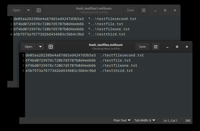
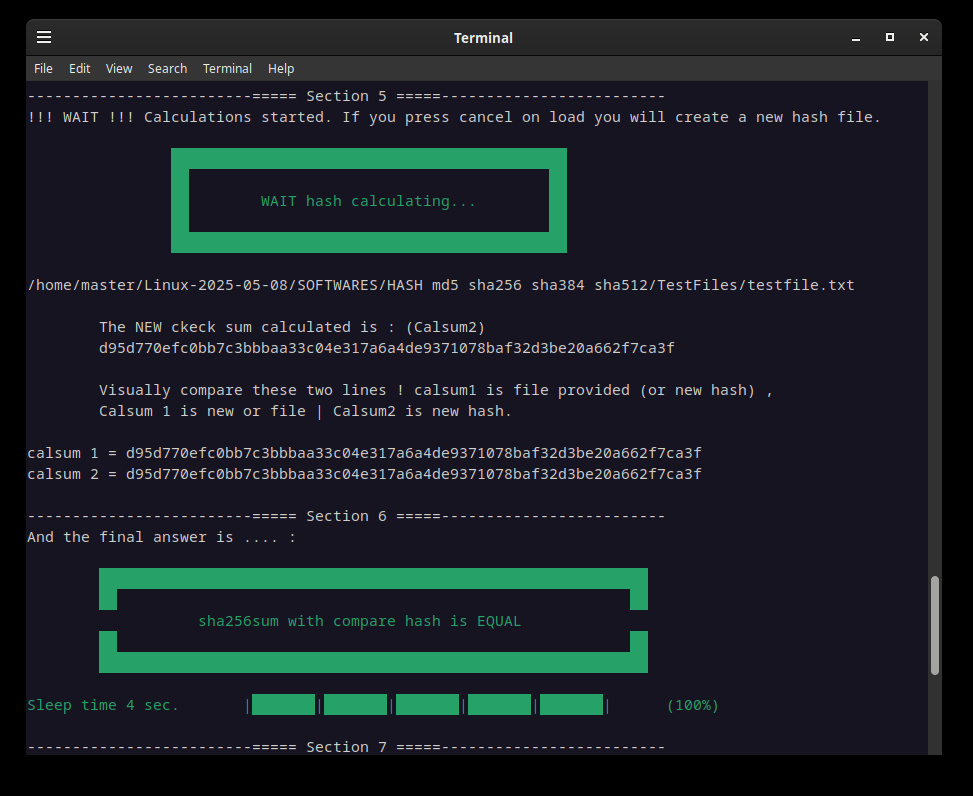

Check/compare/create bash : HASH md5 sha256 sha384 sha512
--------------------------------------------------------------------

FREE Linux Bash software by LostByteSoft

No CopyRIGHT or CopyLEFT, i am juste in the CopyCENTER. That not perfect but me neither.

Easy way or not in bash to verify create and hash for files and folders.

Crc32 b2sum , cksum , sum , Sha1 (Sha are the same as Sha1) , sha224 and sha384 are not included but if you want it just ask !

Created in Linux Debian Cinnamon 12

Tested in Debian Cinnamon 12 & 13 , mint 22.2 and LMDE 7

Udpadted on 2025-10-26-13-21-40

Files and use , main software
--------------------------------------------------------------------

Hash : md5 , sha256 , sha512

check_HASH_V6_XXX.sh

	The main software. Will ask for 1 files (and check if hash file exist then autoload
	OR ask for a second file WITH MULTIPLE HASH INSIDE and compare the hash include in the second specified/automatic
	file OR (if you click cancel) offer to create new md5 file.
	
	-ask for 1 file
	-watch if *.md5 exist and load (of the same name *.md5)	
	-if not exist, ask for a hash file (*.md5 *.txt).
	-If you don't provide a file will create a new *.md5 file.
	-If you provide a hash file with multiple hash inside it will take the good line.

create_HASH_folder_V6_XXX.sh

	Create for a specified folder you select.

create_HASH_1_file_V6_XXX.sh

	Create md5 for 1 file.

Check_HASH_folder_V6_XXX.sh

	HAsh an entire folder with an HASH.sum file.

Files and use , other files
--------------------------------------------------------------------

Hash ONE FILE ONLY : crc32 , sha224 , sha384

Check_crc32_1_file_V6_2025XXXX.sh

Check_sha224_1_file_V6_2025XXXX.sh

Check_sha384_1_file_V6_2025XXXX.sh

	The main software. Will ask for 1 files (and check if hash file exist then autoload
	OR ask for a second file WITH MULTIPLE HASH INSIDE and compare the hash include in the second specified/automatic
	file OR (if you click cancel) offer to create new md5 file.
	
	-ask for 1 file
	-watch if *.md5 exist and load (of the same name *.md5)	
	-if not exist, ask for a hash file (*.md5 *.txt).
	-If you don't provide a file will create a new *.md5 file.
	-If you provide a hash file with multiple hash inside it will take the good line.

Converter(s)
--------------------------------------------------------------------

Convert_md5_to_md5sum_V6_2025XXXXXXX.sh

	Converter for bad formatted md5 sums as https://en.wikipedia.org/wiki/Md5sum suggest.
	
	Select one file and convert all lines.

	Exemple: Convert the first line of the file to the second line, in the same folder.
	
	Will create a new file (allo.md5 To allo.md5sums).
	
	adabcdefe888c2c38a8f8aebe2345678 *..\1234.bin
	
	adabcdefe888c2c38a8f8aebe2345678 ./1234.bin
	

Specials & extras
--------------------------------------------------------------------

testfile.txt

	This is the test file to hash.

testfile.txt.sha256sum

	In this file there are the pre-calculated hash and the file name. You (if you create
	 this file) must follow the corect format, or correct the file to respect the format. 
	 HOW: Is the hash code plus two (2) spaceS and the name of the file. Only the first 
	 line is revelant for now. Exemple of the first line : 
	 0ca160e99aa0e719a4926797292654f9a26bc9591beee21a8ec6f2808616acee  testfile.txt 
	 Only the first line is revelant for now.

FREE Linux Bash software by LostByteSoft

Old versions
--------------------------------------------------------------------

--------------------------------------------------------------------

	JUST DO WHAT YOU WANT WITH THE PUBLIC LICENSE

	Version 3.1415926532 (January 2022)

	TERMS AND CONDITIONS FOR COPYING, DISTRIBUTION AND MODIFICATION
   
	Everyone is permitted to copy and distribute verbatim or modified copies of
	this license document.

	As is customary and in compliance with current global and interplanetary
	regulations, the author of these pages disclaims all liability for the
	consequences of the advice given here, in particular in the event of partial
	or total destruction of the material, Loss of rights to the manufacturer
	warranty, electrocution, drowning, divorce, civil war, the effects of radiation
	due to atomic fission, unexpected tax recalls or encounters with
	extraterrestrial beings elsewhere.

	LostByteSoft no copyright or copyleft we are in the center.

--------------------------------------------------------------------
# --- End of file ---
