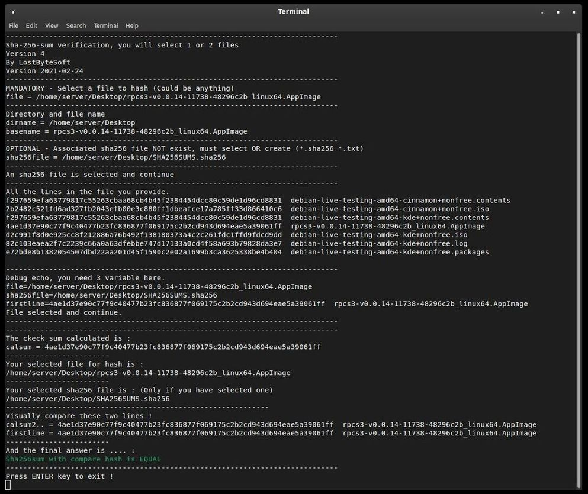
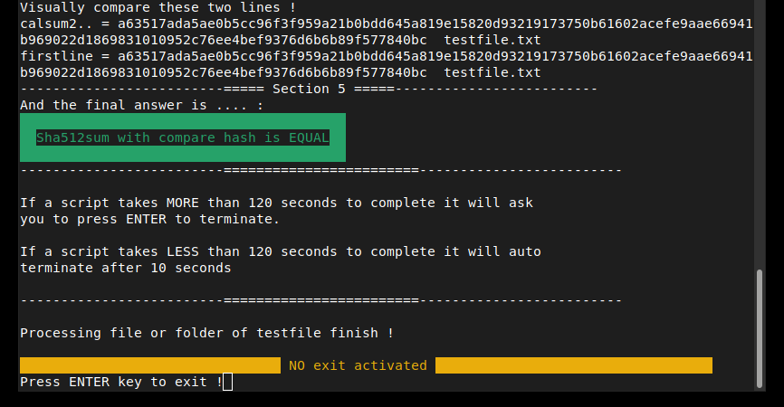
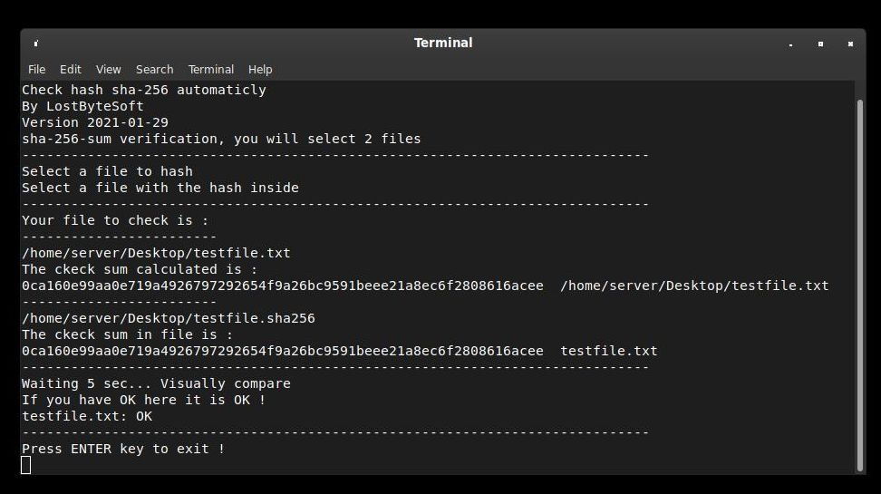
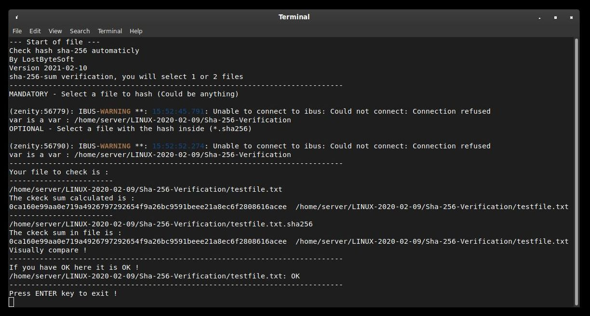
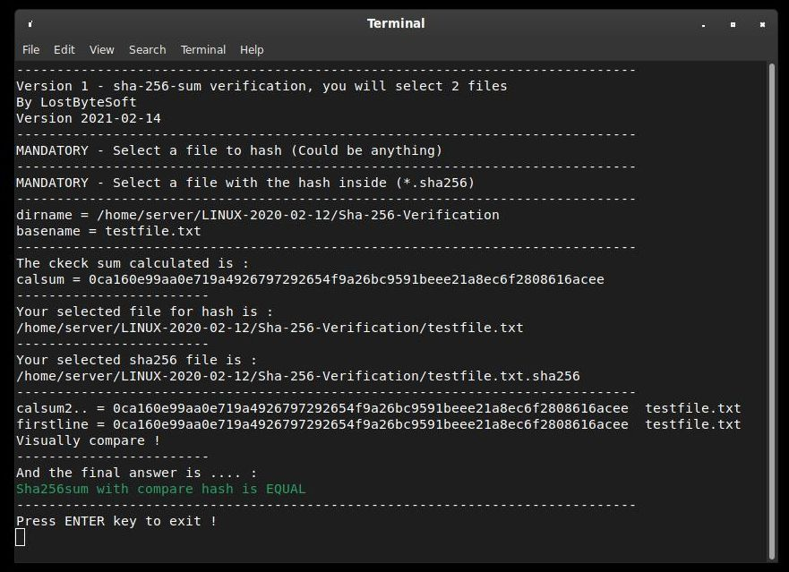
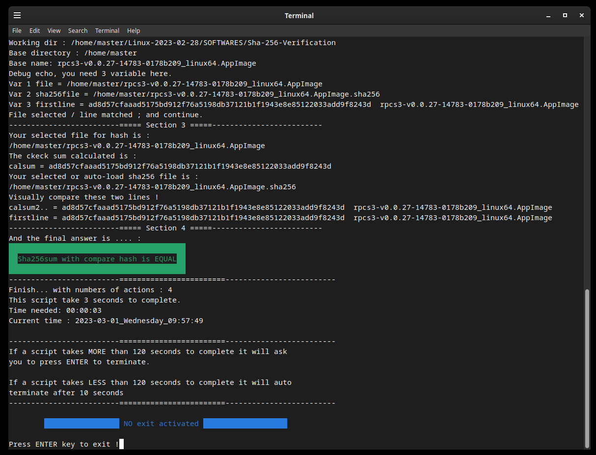

Check/compare/create bash : HASH md5 sha256 sha384 sha512
--------------------------------------------------------------------

FREE Linux Bash software by LostByteSoft

No CopyRIGHT or CopyLEFT, i am juste in the CopyCENTER. That not perfect but me neither.

Easy way or not in bash to verify create and hash for files and folders.

Crc32 b2sum , cksum , sum , Sha1 (Sha are the same as Sha1) and Sha224 are not included but if you want it just ask !

Tested and created in Linux Debian Cinnamon 12

IF YOU RENAME FILES BE SURE TO RENAME THE FILE IN HASH SUM TOO.

Files and use , MD5
--------------------------------------------------------------------

check_md5_V5,3_V_XXX.sh

	The main software. Will ask for 1 files (and check if hash file exist then autoload
	OR ask for a second file WITH MULTIPLE HASH INSIDE and compare the hash include in the second specified/automatic
	file OR (if you click cancel) offer to create new md5 file.
	
	-ask for 1 file
	-watch if *.md5 exist and load (of the same name *.md5)	
	-if not exist, ask for a hash file (*.md5 *.txt).
	-If you don't provide a file will create a new *.md5 file.
	-If you provide a hash file with multiple hash inside it will take the good line.

create_md5_folder_V3,2_V_XXX.sh

	Create for a specified folder you selected all *.md5 file. Will create ONLY ONE file 
	for EACH file to hash.

create_md5_1_file_V_XXX.sh

	Create md5 for 1 file.

Files and use , SHA256
--------------------------------------------------------------------

Secure Hash Algorithms

Consider V5 as best option. But all version is working fine.

-Check_sha256_V1.sh

	The main software. Will ask for 2 files, one after another, and compare the hash
	include in the second specified file.
	
	-ask for 2 file (You must fournish 2 files)

-Check_sha256_V2.sh

	The main software. Will ask for 1 files (and check if hash file exist then
	autoload OR ask for a second file and compare the hash include in the second specified/automatic
	file.
	
	-ask for 1 file
	-watch if *.sha256 exist and load (of the same name *.sha256)
	-if not exist, ask for a hash file (*.sha256 *.txt).
	
-Check_sha256_V3.sh

	The main software. Will ask for 1 files (and check if hash file exist then autoload
	OR ask for a second file and compare the hash include in the second specified/automatic
	file OR (if you click cancel) offer to create new sha256 file.
	
	-ask for 1 file
	-watch if *.sha256 exist and load (of the same name *.sha256)	
	-if not exist, ask for a hash file (*.sha256 *.txt).
	-If you don't provide a file will create a new *.sha256 file.
	
-Check_sha256_V4.sh

	The main software. Will ask for 1 files (and check if hash file exist then autoload
	OR ask for a second file WITH MULTIPLE HASH INSIDE and compare the hash include in the second specified/automatic
	file OR (if you click cancel) offer to create new sha256 file.
	
	-ask for 1 file
	-watch if *.sha256 exist and load (of the same name *.sha256)	
	-if not exist, ask for a hash file (*.sha256 *.txt).
	-If you don't provide a file will create a new *.sha256 file.
	-If you provide a hash file with multiple hash inside it will take the good line.
	
-check_sha256_V5,2_V_XXX.sh

	-Same as V4 but updated gui.

-check_sha256_V5,3_V_XXX.sh

	-Same as V5,2 but updated gui and software.

Screenshot of the version 4.

create_sha256_1_file_V_XXX.sh

	Create sha256 for 1 file.

create_sha256_folder_V1.sh

	NEED to put in the folder you want create for a specified folder all *.sha256 file.
	Will create a new file for EACH file to hash.

create_sha256_folder_V2.sh

	Create for a specified folder you selected all *.sha256 file. Will create a new file 
	for EACH file to hash.
	
create_sha256_folder_V3.sh

	Create for a specified folder you selected all *.sha256 file. Will create ONLY ONE file 
	for EACH file to hash.

create_sha256_folder_V3,2_V_XXX.sh

	Create for a specified folder you selected all *.sha256 file. Will create ONLY ONE file 
	for EACH file to hash.

Files and use , SHA384
--------------------------------------------------------------------

check_sha384_V5,3_V_XXX.sh

	The main software. Will ask for 1 files (and check if hash file exist then autoload
	OR ask for a second file WITH MULTIPLE HASH INSIDE and compare the hash include in the second specified/automatic
	file OR (if you click cancel) offer to create new sha384 file.
	
	-ask for 1 file
	-watch if *.sha384 exist and load (of the same name *.sha384)	
	-if not exist, ask for a hash file (*.sha384 *.txt).
	-If you don't provide a file will create a new *.sha384 file.
	-If you provide a hash file with multiple hash inside it will take the good line.

create_sha384_folder_V3,2_V_XXX.sh

	Create for a specified folder you selected all *.sha384 file. Will create ONLY ONE file 
	for EACH file to hash.

create_sha384_1_file_V_XXX.sh

	Create sha384 for 1 file.

Files and use , SHA512
--------------------------------------------------------------------

check_sha512_V5,3_V_XXX.sh

	The main software. Will ask for 1 files (and check if hash file exist then autoload
	OR ask for a second file WITH MULTIPLE HASH INSIDE and compare the hash include in the second specified/automatic
	file OR (if you click cancel) offer to create new sha512 file.
	
	-ask for 1 file
	-watch if *.sha512 exist and load (of the same name *.sha512)	
	-if not exist, ask for a hash file (*.sha512 *.txt).
	-If you don't provide a file will create a new *.sha512 file.
	-If you provide a hash file with multiple hash inside it will take the good line.

create_sha512_folder_V3,2_V_XXX.sh

	Create for a specified folder you selected all *.sha512 file. Will create ONLY ONE file 
	for EACH file to hash.

create_sha512_1_file_V_XXX.sh

	Create sha512 for 1 file.

Specials & extras
--------------------------------------------------------------------

testfile.txt

	This is the test file to hash.

testfile.txt.sha256sum

	In this file there are the pre-calculated hash and the file name. You (if you create
	 this file) must follow the corect format, or correct the file to respect the format. 
	 HOW: Is the hash code plus two (2) spaceS and the name of the file. Only the first 
	 line is revelant for now. Exemple of the first line : 
	 0ca160e99aa0e719a4926797292654f9a26bc9591beee21a8ec6f2808616acee  testfile.txt 
	 Only the first line is revelant for now.

FREE Linux Bash software by LostByteSoft

Old versions
--------------------------------------------------------------------

Version 2021-01-29

Version 2021-02-10

Version 2021-02-14

Version 2021-02-14 (check_sha256_V5,1.sh)

--------------------------------------------------------------------

	JUST DO WHAT YOU WANT WITH THE PUBLIC LICENSE

	Version 3.1415926532 (January 2022)

	TERMS AND CONDITIONS FOR COPYING, DISTRIBUTION AND MODIFICATION
   
	Everyone is permitted to copy and distribute verbatim or modified copies of
	this license document.

	As is customary and in compliance with current global and interplanetary
	regulations, the author of these pages disclaims all liability for the
	consequences of the advice given here, in particular in the event of partial
	or total destruction of the material, Loss of rights to the manufacturer
	warranty, electrocution, drowning, divorce, civil war, the effects of radiation
	due to atomic fission, unexpected tax recalls or encounters with
	extraterrestrial beings elsewhere.

	LostByteSoft no copyright or copyleft we are in the center.

--------------------------------------------------------------------
# --- End of file ---
